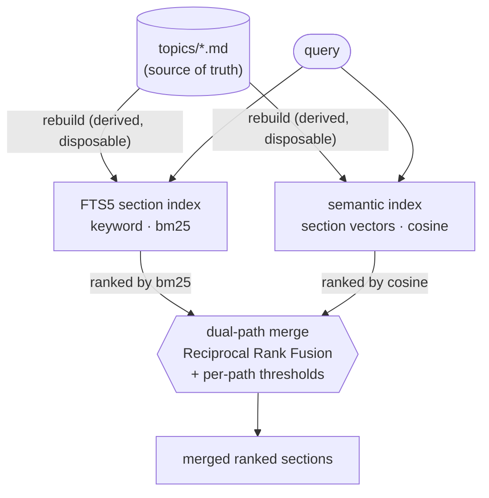

# evidence-grounded-memory

[](https://github.com/wasabikev/evidence-grounded-memory/actions/workflows/tests.yml)
[](LICENSE)


**A reference implementation of agent memory as a living evidentiary record — where vector search is retrieval infrastructure, not the memory substrate.**

Durable, human-readable markdown is the source of truth. Keyword and semantic search are *derived,
disposable* views over it. Every fact carries provenance and an authority tier, and a fact's standing
is **re-graded over time** as stronger evidence arrives — promoted when corroborated, superseded when
contradicted, with the change recorded rather than overwritten.

This repo reproduces the design decisions of a production memory system as a clean, runnable reference
implementation. It is a *demonstration of the architecture*, not a copy of the production code: the
**what and why** is the asset.

---

## At a glance

| | |
|---|---|
| **Thesis** | Agent memory is an evidentiary record with a changelog — not a key-value store, and not reducible to its vector index (vectors are a derived retrieval path, not the substrate). |
| **Source of truth** | Human-readable markdown topic files (`topics/*.md`, H2-sectioned). Every index is derived from them and disposable. |
| **Trust** | 7-tier / 14-category provenance vocabulary; every fact tagged inline (`[doc:e037·A]`, `[user]`, `[ai]`). |
| **Temporal authority** | Facts enter *provisional*, then get promoted (`confirmed by …`) or superseded (`superseded … by …`) as evidence accumulates — non-destructively. |
| **Retrieval** | Dual-path: FTS5 keyword + semantic vector search, run in parallel and **merged**. |
| **Injection** | Split token budget (shared pool + separate INDEX cap) so no single topic crowds out cross-domain context. |
| **Source recall** | Held documents are a first-class substrate: a passive per-agent inventory + a derived content index surface a document's text, so the agent recalls and cites primary sources, not just distilled memory. |
| **Demo domain** | Home renovation / permitting (spans all 7 tiers: building code → permit guidance → contractor docs → product reviews → homeowner statements → AI inference). |

**Quickstart**

```bash
python examples/demo.py     # ingest → tag → recall → inject, end to end
```

> Status: design narrative complete; runnable core implemented and demonstrated. See [Roadmap](#roadmap).

---

## The eight design decisions

The table below is the spine of the repo. Each decision exists because the obvious approach fails in a
specific, nameable way.

| # | Decision | Problem it solves | Why the obvious approach fails |
|---|---|---|---|
| 1 | **Dual-path recall** (keyword + semantic, merged) | Retrieve both exact technical terms and conceptually-near context | Pure semantic search misses exact matches (a permit code, a name); pure keyword search misses conceptual proximity. Neither path alone is enough — the **merge** is the point. |
| 2 | **Split-budget injection** | Keep cross-domain context alive under a fixed token budget | A single shared budget lets one large or highly-relevant topic monopolize the prompt, starving other domains. A partitioned budget is a deliberate constraint, not a default. |
| 3 | **Authority-tiered provenance** | Weight facts by where they came from | Treating a statute, a forum post, a user statement, and a model's own guess as equally trustworthy produces confident nonsense. Memory needs provenance and an authority model. |
| 4 | **Sources registry** | Resolve inline provenance tags to full source metadata | Inline tags alone (`[doc:e037·A]`) are opaque; without a canonical registry you can't audit *what* `e037` is, its recency, or its scope-fit. |
| 5 | **Temporal re-grading** (promotion & supersession) | Let a fact's trust evolve as evidence accumulates | Stamping authority once at write time is wrong: a low-tier user statement may later be corroborated by a statute, or contradicted by one. Overwriting destroys the audit trail of *what the agent believed and why it changed*. |
| 6 | **Scheduled consolidation** | Keep the corpus coherent without manual curation | Left alone, a memory store drifts into duplication, contradiction, and stale confidence. A non-destructive, idempotent, budget-aware pass backstops runtime and re-grades the corpus. |
| 7 | **Section-level indexing** | Inject just the relevant *section*, not a whole topic | Document-level indexing forces a choice between injecting an entire topic (blows the budget) or nothing. H2-sectioned markdown indexed at section granularity makes budget-aware injection possible. |
| 8 | **Source-document recall** | Make held documents discoverable and content-searchable, per agent | Holding a document isn't the same as being able to use it: filename-only search misses what's in the body, and the agent can't reach for a source it doesn't know it has. A passive per-agent inventory + a derived content index let the repository surface its own primary sources. |

**Temporal re-grading (#5)** is where this design departs most from conventional agent memory — it models
something a vector index leaves out entirely: a fact's standing changing as evidence accumulates. It is
reinforced by the provenance layer (**#3 / #4**) and by **source-document recall (#8)**, which lets the
repository surface its own primary sources. The retrieval foundations — **dual-path hybrid search (#1)**
and **section-level indexing (#7)** — are deliberately *standard* best practices, included because the
system rests on them, not as novel contributions: hybrid keyword+semantic retrieval is table stakes here,
and this design treats it as such.

The markdown topic files are the source of truth; both indexes are derived and disposable, and the
**merge** — not either path alone — is the point:



Two more diagrams — the split budget and the tier/re-grading lifecycle — are in
[docs/diagrams/](docs/diagrams/).

---

## Memory is a stack, not a search

"Agent memory" is usually shorthand for a vector database: embed every chunk, retrieve top-k by cosine
similarity, paste into the prompt. That answers one narrow question — *which text is semantically nearest
the query* — and treats memory as a lookup. It isn't a lookup; it's a **stack of layers**, each assuming
the one beneath it:

1. **Substrate — what *is* the memory?** A vector index is opaque and unauditable. The ground layer is
   durable markdown topic files as the source of truth; every index is a derived, rebuildable view.
2. **Provenance — the foundation everything rests on.** Every fact carries where it came from and an
   authority tier. You cannot resolve conflicts or safely act on memory you can't weigh by source:

   | A | B | C | D | E | F | G |
   |---|---|---|---|---|---|---|
   | regulation | official guidance | professional standard | first-party doc | aggregated 3rd-party | user | AI |

   Facts are tagged inline — `[doc:e037·A]`, `[user]`, `[ai]` — and the tier governs how conflicts resolve.
3. **Temporal authority — trust changes over time.** A fact's standing is re-graded as evidence
   accumulates, non-destructively. From the demo: an AI guess — *"composite likely has the lower ten-year
   cost `[ai]`"* — is **superseded** when the contractor's quote arrives: *"cedar has the lower ten-year
   cost `[doc:e060·D]`"*. The old belief is kept as audit history, not overwritten.
4. **Retrieval — getting the right layer back.** Keyword and semantic search, merged, packing the relevant
   *section* under a budget. A standard, necessary layer — not the system.

**The opinionated part:** provenance and temporal authority aren't bolted onto retrieval — they *are* the
foundation. Most "agent memory" skips them and ships a vector index; this treats them as non-negotiable.
A strong foundation is what makes memory safe to *grow*: to absorb messy, high-volume, low-signal inputs
without flooding itself with garbage. And it's the floor, not the ceiling — memory is layers, like a
network stack, with more above these (entity resolution — knowing two mentions name the same thing — is
one). See the [Roadmap](#roadmap).

*Lineage: the file-first, passive-injection foundation is validated by [Vercel's AGENTS.md evals](https://vercel.com/blog/agents-md-outperforms-skills-in-our-agent-evals) (passive context scored 100% vs. 53% when the agent must decide to retrieve) and used in practice by assistants like [OpenClaw](https://github.com/openclaw/openclaw); this repo's focus is the evidence layers on top.*

Full treatment: **[docs/architecture.md](docs/architecture.md)**.

---

## Repo map

```
evidence-grounded-memory/
├── README.md                  ← you are here
├── docs/
│   ├── architecture.md        ← full design narrative (the long form)
│   └── diagrams/              ← dual-path recall · budget split · tier flow
├── memory/                    ← runnable retrieval core
│   ├── store.py               ← file-first store + FTS5 section index
│   ├── semantic_index.py      ← vector search layer
│   ├── injector.py            ← split-budget injection + dual-path merge
│   └── consolidator.py        ← slim consolidator: dedup + re-tier
├── evidence/                  ← the authority / provenance layer
│   ├── tiers.py               ← 7-tier / 14-category vocabulary + resolver
│   └── sources.py             ← sources registry schema + tag parser
├── documents/                 ← source-document recall (decision #8)
│   ├── index.py               ← derived FTS5 index over filename + gist + body
│   └── inventory.py           ← passive "Source documents" inventory block
├── examples/
│   └── demo.py                ← end-to-end: ingest → tag → recall → inject
└── tests/                     ← behavior-demonstrating tests
```

Start with [`memory/`](memory/README.md) for the retrieval core and [`evidence/`](evidence/README.md)
for the provenance layer.

---

## What this repo is (and isn't)

- **It is** a reference implementation that reproduces the production system's *design decisions*
  cleanly, in a neutral domain, with runnable code for the core and described-only treatment of the
  heavier periphery.
- **It is not** a copy of production code, and it deliberately withholds the *calibration* — the
  domain-tuned recognition cues, production prompts, thresholds, and ranking weights. Those stay in-house;
  the architecture and its rationale are the asset. See the publication boundary in
  [docs/architecture.md](docs/architecture.md#publication-boundary).

---

## Roadmap

- [x] Design narrative + eight decisions
- [x] Evidence layer (`tiers.py`, `sources.py`)
- [x] File-first store + section-level FTS5 (`store.py`)
- [x] Semantic index (`semantic_index.py`)
- [x] Split-budget dual-path injector (`injector.py`)
- [x] Slim consolidator: dedup + re-tier (`consolidator.py`)
- [x] Source-document recall: per-agent FTS5 document index + passive inventory (`documents/`)
- [x] End-to-end demo (`examples/demo.py`) + tests
- [ ] **Next:** entity resolution (knowing two mentions name the same thing); a stronger ingestion gate so the foundation can absorb high-volume, low-signal sources without polluting memory

Runs on Python 3.9+ with **zero third-party dependencies** (stdlib `sqlite3` FTS5 + a local embedder).

```bash
python examples/demo.py                          # full pipeline, end to end
python -m unittest discover -s tests -p "test_*.py"   # behavior-demonstrating tests
```

---

## License

[Apache License 2.0](LICENSE). Permissive reuse with an explicit patent grant; the temporal re-grading
mechanism is published deliberately as prior art.
