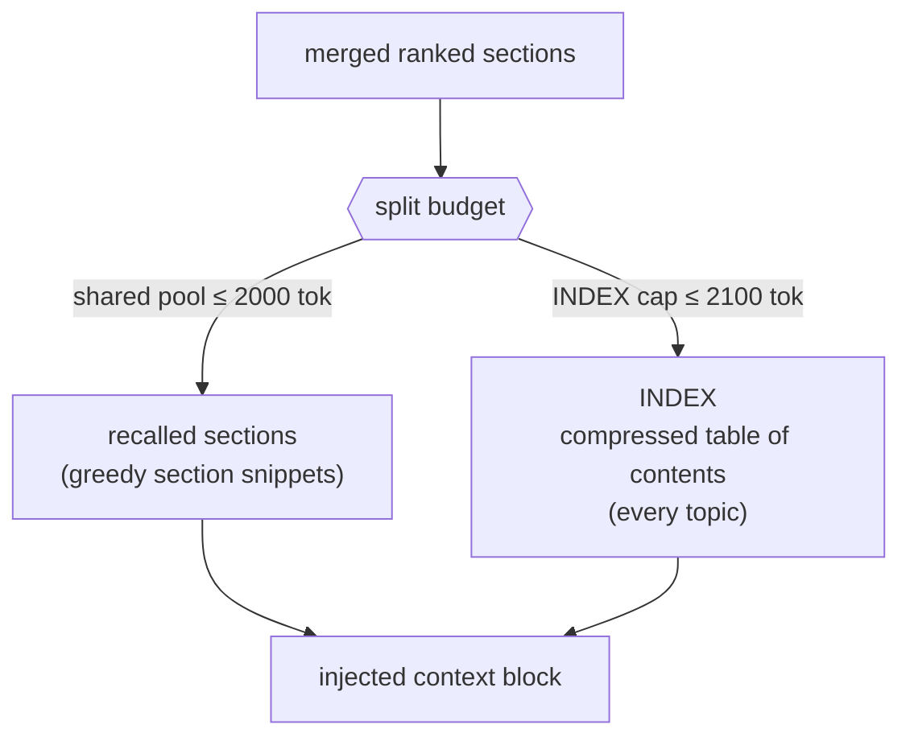
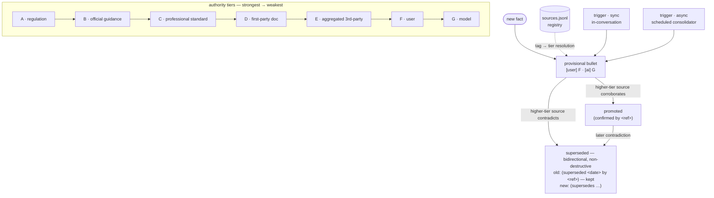

# Architecture — evidence-grounded-memory

**Status:** Active
**Scope:** memory retrieval + provenance/evidence layer

## Purpose

The long-form design narrative behind the reference implementation: the problem framing, the ten
design decisions, and the boundary between what this repo publishes and what it deliberately withholds.
The [repo README](../README.md) is the compressed read; this is the depth.

---

## The problem

"Agent memory" is usually shorthand for a vector database: embed every chunk, retrieve top-k by cosine
similarity, paste into the prompt. That framing answers one narrow question — *which text is semantically
nearest the query* — and treats memory as a lookup. Memory is a stack of layers, and a vector-DB framing
collapses all but one — quietly assuming away the problems that make persistent memory hard at production
scale. Four of them:

### 1. What *is* the memory? (substrate)

A vector index is opaque, lossy, and unauditable — you can't read it, diff it, or hand a topic to a human
and say "this is what the agent knows about you." This system treats durable, human-readable **markdown
topic files** (`topics/*.md`, H2-sectioned) as the *source of truth*, and every index — keyword and
semantic — as a **derived, disposable view** rebuilt from that text. Semantic search is a retrieval
path, **not** the memory system. This file-first stance is the foundation the other three problems are
solved on top of.

### 2. One retrieval path is never enough (plural retrieval)

Pure semantic search misses exact-match technical terms (a permit code, a person's name); pure keyword
search misses conceptual proximity. You need both running in parallel with a merge layer that reconciles
them — and it must inject only the relevant *section* of a topic, inside a fixed token budget that no
single topic is allowed to monopolize.

### 3. Not all facts deserve equal trust (provenance)

A claim from a statute, from a forum post, from the user directly, and from the model's own inference
cannot be weighted the same. Memory needs provenance — every fact carries where it came from — and an
authority model that governs how conflicts resolve and when output is flagged for verification.

### 4. Authority is temporal, not fixed at write time (temporal authority)

Vector search can surface an old fact, but it has no way to represent that the fact's standing has
changed. Facts arrive at different times from sources of different strength, and their standing
*changes as evidence accumulates*. A fact can enter the store as a
low-tier user statement or AI inference, then be **promoted** when a higher-authority document later
corroborates it — or **superseded** when an authoritative source contradicts it. Memory is therefore a
*living evidentiary record*: provisional on entry, continuously re-graded, and held coherent over time by
a scheduled consolidation pass that dedups, reconciles, and re-tiers. Without that, the corpus drifts
into contradiction and stale confidence.

These four problems map directly onto decisions #1–#7 below. An eighth decision — **source-document
recall** — extends the same file-first thesis to a second substrate (held documents), and is covered in §8.
A ninth — **cross-topic backlinks** — answers a question the four problems above don't quite cover: not
"is this fact trustworthy" but "does this topic know about a related fact living in a different file."
Covered in §9.

---

## The architecture

**File-first.** Human-readable markdown topic files are the source of truth; the keyword (FTS5) and
semantic (vector) indexes are derived views rebuilt from that text.

**Dual-path recall.** Both indexes run in parallel and a merge layer reconciles their results.

**Split-budget passive injection.** The relevant *sections* are assembled into the prompt before each
call, within a fixed, partitioned token budget.

**Interwoven provenance layer.** Every fact is tagged with its source and authority tier.

**Scheduled consolidation.** Because authority is temporal, a scheduled pass re-grades the corpus over
time — promoting corroborated facts, marking superseded ones, deduplicating, and keeping tiers honest.

**Source-document recall.** Held documents are a second substrate alongside topic memory: a derived content
index makes a document's text discoverable and recallable, resolved the same way topic memory is — an
inline citation when it's already been cited, an explicit search when it hasn't.

**Cross-topic backlinks.** A link between two topic sections is recorded as two independently-written
markers, not one derived from the other — so the consolidator can reconcile them and catch drift, the
same way it reconciles authority tiers (#6).

> **Lineage.** The file-first, inject-the-markdown-into-the-prompt foundation is well-trodden. Vercel's
> *AGENTS.md outperforms skills in our agent evals* (Jude Gao, Jan 2026) found passive context scored
> **100%** where leaving the agent to *decide* to retrieve scored **53%** — *"there's no moment where the
> agent must decide 'should I look this up?' The information is already present."*
> ([source](https://vercel.com/blog/agents-md-outperforms-skills-in-our-agent-evals)) Open-source
> assistants like [OpenClaw](https://github.com/openclaw/openclaw) run on the same injected-markdown
> pattern (`AGENTS.md`, `SOUL.md`). This repo takes that foundation as given; its contribution is the
> layers built on top — authority-tiered provenance (#3/#4) and temporal re-grading (#5). The "no decision
> point" principle is exactly what #8 applies to source documents: discovery as a structural invariant.

---

## Key design decisions

### 1. Dual-path recall (keyword + semantic, merged)

FTS5 keyword index and semantic vector search run in parallel, then a merge/ranking layer combines them.
Pure semantic search misses exact-match technical terms; pure keyword search misses conceptual proximity.
The merge — not either path alone — is the point.

Hybrid keyword+semantic retrieval is, by now, a well-established pattern — *not* a novel contribution, and
not presented as one. It's documented here because the system rests on it and because the *integration*
choices are what matter: running it at **section** granularity, over a **file-first / derived-disposable**
source of truth, with per-path admission thresholds, feeding the **split budget** (#2). The pattern is
table stakes; the way it's wired into an evidentiary memory is the point.

The reference merge is **Reciprocal Rank Fusion** — it combines the two *rankings*, not raw scores, so no
cross-path score calibration is needed. Production uses tuned score-fusion weights; those are the withheld
calibration. (Diagram: [diagrams/dual-path-recall.md](diagrams/dual-path-recall.md).)

### 2. Split-budget context injection

A fixed injection budget split between a shared pool (~2K tokens) and a separate INDEX cap (~2.1K).
Prevents any single topic from crowding out cross-domain context. A deliberate architectural constraint,
not a default.

Because the shared pool and the INDEX have *independent* caps, a single large or highly-relevant topic
can fill the pool without starving the cross-domain map. (Diagram:
[diagrams/budget-split.md](diagrams/budget-split.md).)

> *Production note:* the production system also injects CORE profile, tasks, session summaries, and a
> temporal summary. The reference version simplifies to the shared-pool / INDEX split to keep the story
> clean. The illustrative token allocations here are re-derivable defaults, not tuned production values.

### 3. Authority-tiered provenance (the evidence layer)

A 7-tier / 14-category source vocabulary. Every memory bullet carries an inline tag (`[doc:e037·A]`,
`[user]`, `[ai]`). The tier governs how conflicting facts are weighted and whether output is flagged for
verification. This is **interwoven with the memory system, not a separate module** — which is why
`evidence/` and `memory/` live in one repo.

### 4. Sources registry

A canonical registry of all ingested documents (`sources.jsonl`). Inline provenance tags in memory
bullets resolve back to this registry for full metadata (label, category, tier, recency, scope-fit).

### 5. Temporal authority — promotion & supersession

**The part conventional vector-memory designs usually do not model.** Authority is not stamped once at
write time; a fact's standing evolves as evidence
accumulates. The system makes that evolution *first-class and auditable* rather than destructive:

- **Provisional on entry.** A fact written from a user statement (`[user]`, Tier F) or model inference
  (`[ai]`, Tier G) enters at low authority — it is recorded, not trusted.
- **Promotion via corroboration.** When a higher-authority source later confirms the same claim, the
  bullet gains an inline `(confirmed by <ref>)` annotation — its effective trust rises without rewriting
  history.
- **Supersession, recorded bidirectionally.** When an authoritative source contradicts an existing
  bullet, the system writes a *paired* annotation: the new bullet gets `(supersedes …)` and the old
  bullet gets `(superseded YYYY-MM-DD by <ref>)`. The original is never deleted — the audit trail of
  *what the agent believed and why it changed* is preserved.
- **Two trigger points, same record.** Re-grading happens **synchronously** (in-conversation: when a
  higher-tier source enters the chat, the agent reconciles it against injected memory and updates in the
  same turn — firing on the evidence, informing the user rather than asking) **and asynchronously** (the
  scheduled consolidator backstops runtime omissions and pre-feature corrections).

(Diagram: [diagrams/tier-flow.md](diagrams/tier-flow.md).)

Stated plainly: *memory is an evidentiary record with a changelog, not a key-value store.* Trust is
a function of corroboration over time, and the system encodes that as durable, human-readable annotations
rather than silent overwrites. Decisions #3 (tiers) and #4 (sources) supply the vocabulary; this decision
is what makes them *dynamic*. Decision #6 is one of its two execution paths.

### 6. Scheduled consolidation

A scheduled agent pass that merges, deduplicates, and re-tiers memory topics — keeping the knowledge base
coherent over time without manual curation. It is the *asynchronous* execution path for the temporal
re-grading in #5 (catching corroboration/supersession the runtime missed) plus the mechanism that
prevents corpus drift. Non-destructive, idempotent, budget-aware.

> *Reference scope:* the runnable consolidator here is deliberately slim — bullet dedup + re-tier via the
> sources registry. Task archival, profile dedup, and topic-reorg overflow handling exist in production
> and are described-only.

#### A safety-ordered remediation ladder

A bare "oversized section → compress" rule can't distinguish two different problems: duplicate bloat (safe
to collapse, loses nothing) and genuine drill-down growth (compressing it is real data loss). The fix is
ordering, not a smarter compressor: an in-session ladder that tries `exact_dedup` — free, lossless, the
same normalized-key match `consolidate()` already runs nightly — first, and only escalates to `compress`
(LLM, preservation-intended) while the section is still over budget after that. A section that survives
both rungs un-healed is flagged, not force-compressed — the ladder's ordering *is* the cause-diagnosis:
cheap and reversible before expensive and lossy.

The dedup key itself is punctuation-insensitive, closing a gap where the exact-string key missed
format-only reword of the same fact (`tailwindcss: ^4.3.2` vs `tailwindcss@^4.3.2`) — the dominant
duplicate pattern observed in practice, distinct from genuine paraphrase.

> *Reference scope:* the ladder and the punctuation-insensitive key are both fully runnable here. The
> trigger condition uses an illustrative, demo-scaled length threshold — production's real embedding-budget
> threshold and per-topic cooldown are withheld calibration, per the publication boundary below.

### 7. Section-level indexing

Topics are H2-sectioned markdown; the FTS5 index operates at the *section* level, not the document level.
This enables budget-aware injection of just the relevant section rather than a whole topic — the
mechanism that makes decision #2 possible.

### 8. Source-document recall

Held documents (uploaded files) are a second knowledge substrate alongside topic memory: where topics hold
*distilled* knowledge, documents hold *primary-source* knowledge. The design that shipped first here was a
standing per-agent inventory, pushed into every turn — "discovery as a structural invariant, not a tool the
agent must remember to call." It was the obvious fix for the production failure that motivated this
decision (filename-only matching missed answers that lived in a document's body), and it worked. Then two
things showed up under measurement: for any document a topic memory had already cited, the standing catalog
was telling the agent nothing the `[doc:<ref>]` citation hadn't already surfaced inline — and the catalog's
per-turn index rebuild was expensive enough, at real corpus size, to starve the retrieval tiers running
after it. **The fix was to remove the standing catalog, not to make it faster.** Documents are now reached
the way the citation channel already implied they should be: a `[doc:<ref>]` reference resolves to
recallable content on demand, backed by the same derived FTS5 index the catalog used to rebuild eagerly —
now built lazily, off any per-turn path.

This is a *build → measure → remove* story, not a retraction. The passive-injection bet was reasonable
given what was known at ship time; measurement is what made the redundancy and the cost visible, and
removing an accidental mechanism once it's recognized as accidental is the same discipline the rest of this
system rests on (see #5 — a fact's standing changes as evidence accumulates; a design's standing can too).
The one accepted tradeoff: a document relevant to a turn that nothing has cited *yet* is no longer surfaced
proactively — treated here as a signal that the extraction pipeline should have written a memory about it,
not a gap a standing catalog should mask.

> *Reference scope:* the FTS5 index and search primitive are unchanged from the original design — only the
> trigger moved, from an ambient per-turn scan to an explicit query. Per-agent isolation remains a described
> production property, not exercised by this single-tenant demo, same as the original #8 narrative.

### 9. Cross-topic backlinks

The obvious answer to "how do facts about related things stay connected" is a graph database. That's the
wrong size here: topic routing (#1–#7) already resolved *which file* a fact belongs in — the entities
already exist. What's missing isn't an index, it's a cheap way to record "this also relates to that"
using the same write path everything else uses.

The mechanism is **double-entry, not derived**: a forward marker in topic A's section, a "referenced by"
marker in topic B's section — two independently-written facts, not one computed from the other at read
time. That's the entire reason it's checkable. A backlink *derived* from one side (recomputed on demand,
never separately stored) is consistent by construction — there is nothing to compare it against, so
nothing can ever be detected as wrong. Two independently-recorded sides can drift, and a mismatch between
them is exactly the signal worth catching:

- **Missing marker.** A manual edit removes one side's annotation; reconciliation notices the other
  side now points at nothing.
- **Stale link.** The linked-to section's *substantive* content changes after the link was made. The
  snapshot used for this comparison strips marker lines before hashing — otherwise the act of creating
  the link would itself look like drift, since writing the reverse marker is a write to that section.

Reconciliation is mechanical — a regex match for the marker, a hash comparison — the same shape as #6's
dedup + re-tier passes, run from the same scheduled pass (`consolidator.py` delegates to
`backlinks.reconcile`). No LLM judgment is needed for the check; *deciding* two topics are related in the
first place is the one step that does take judgment (see below).

> *Reference scope:* detecting *that* two topics relate is, in production, an LLM judgment call
> piggybacked on the same extraction step that already routes content to a topic — this repo has no LLM
> at runtime, so the demo bakes that decision in as a labeled fixture ("real design, illustrative data"),
> the same treatment `ai_summary` got for #8. Rewriting a link's markers when a topic is renamed, merged,
> or split is **described-only** — this repo's consolidator already treats topic-reorg the same way (see
> `consolidator.py`'s module docstring), and link-rewrite-on-reorg inherits that boundary rather than
> introducing a new one. Production reuses the exact old→new section mapping its reorg pass already
> computes for its own bookkeeping; nothing about that is calibration, it just isn't runnable here because
> reorg itself isn't.

### 10. Proactive coverage sweep

The first two decisions in this stack (dual-path recall, split-budget injection) assume the memory
*itself* is complete — the open question they don't answer is whether the repository actually has a
summary of everything it should. Two reactive triggers cover most of it: a new message in the same
conversation, or a new conversation started (which checks the single most-recently-created other
conversation). Both look like coverage until you ask *whose activity* each one depends on. A user who
never starts another conversation at all falls through both. A user with several stale conversations only
ever gets the most recent one re-checked by the second trigger — the rest sit uncovered indefinitely.

The fix isn't a third variation on "wait for the user to do something" — it's a structurally independent
sweep that enumerates the actual candidate set (every conversation past its idle threshold with no summary
yet) and works through it directly, capped and deduplicated against work already in flight.
`memory/coverage.py` demonstrates the comparison: given a set of conversations, show what each reactive
trigger would catch, then show what the sweep catches that neither would have reached. The residual is the
point — a repository that can name its own blind spots is doing something a purely reactive design
structurally cannot.

> *Reference scope:* the comparison logic is the full runnable proof. Production's actual scheduling —
> hourly cadence, a 20/pass cap, a 3-attempt retry limit before a conversation drops out of re-candidacy, a
> Redis-persisted resume timestamp across restarts — is described here as real values, not illustrative
> ones, since none of them are domain-tuned calibration; see the publication-boundary table.

---

## Publication boundary

This repo distinguishes **sanitization** (mechanically scrubbing client/infra/tenancy specifics) from the
**publication boundary** (a strategic call about how much *design depth* to publish per decision).

**Governing principle:** *publish the what and why; withhold the calibration.* The architecture and its
rationale are the asset and cost little to share. The **tuning** — vocabularies calibrated over real
engagements, production prompts, thresholds, ranking weights, and eval results — is what stays in-house.
A reference implementation should *demonstrate* each decision, not ship the production-tuned artifact.

**Standing rules:**

- **No production prompts.** Extraction, consolidation, and reconciliation system prompts are withheld;
  reference modules use minimal illustrative prompts.
- **No eval results or tuning data.** No benchmark numbers, thresholds chosen from real data, or ranking
  weights presented as production values (illustrative defaults are fine, labeled as such).
- **The repo is a hook, not a spec.** When in doubt, publish the principle and a clean demo; keep the
  deeper detail out of the repo.

| # | Decision | Publish (the asset) | Withhold (kept in-house) | Sensitivity |
|---|---|---|---|---|
| 1 | Dual-path recall | The merge concept + a working keyword/semantic merge in the neutral domain | Production ranking weights / score-fusion tuned on real data | Low |
| 2 | Split-budget injection | The split principle + partition rationale; illustrative token allocations | — (defaults are re-derivable) | Low |
| 3 | Authority-tiered provenance | Tag format, the 7-tier skeleton, the *concept* of MECE categories | The tuned 14-category cue table (domain-calibrated recognition cues) — generic version only | **High** |
| 4 | Sources registry | Schema shape + tag→source resolution flow | Production enrichment heuristics (independence/recency/scope-fit scoring) | Med |
| 5 | Temporal re-grading | The concept, annotation format, the two-trigger design | Production reconciliation prompts + promotion/supersession heuristics + thresholds | **High** |
| 6 | Scheduled consolidation | The slim dedup + re-tier loop; non-destructive / idempotent / budget-aware principles; the punctuation-insensitive dedup key; the free-before-paid, lossless-before-lossy remediation ladder | Production merge prompts + LLM-judgment heuristics; the full sub-task set; the real embedding-budget threshold and cooldown value | Med |
| 7 | Section-level indexing | Fully — standard technique, no calibration to protect | — | Low |
| 8 | Source-document recall | Content-index + on-demand citation resolution; discovery-as-invariant reframed as resolve-on-demand; the removed standing-inventory mechanism, described as a measured-and-reversed design choice | Per-agent isolation is described-only | Low |
| 9 | Cross-topic backlinks | Fully — the double-entry mechanism, marker rendering, and reconciliation are all structural, no calibration to protect | Detection itself stays an LLM judgment call (described-only, demo uses a fixture); reorg-driven marker rewrite is described-only, same as topic-reorg | Low |
| 10 | Proactive coverage sweep | Fully — the trigger-comparison logic, and the actual scheduling parameters (hourly/20-cap/3-attempt) as real values | — (no domain-tuned calibration to protect) | Low |

The two **High** rows (#3 cue table, #5 mechanism) are where "are we publishing too much?" actually
bites. The handling: publish the principle and shape in full; withhold the calibrated cue table and the
production prompts/thresholds. Publishing #5 is treated as deliberate,
irreversible prior art — not a default.
