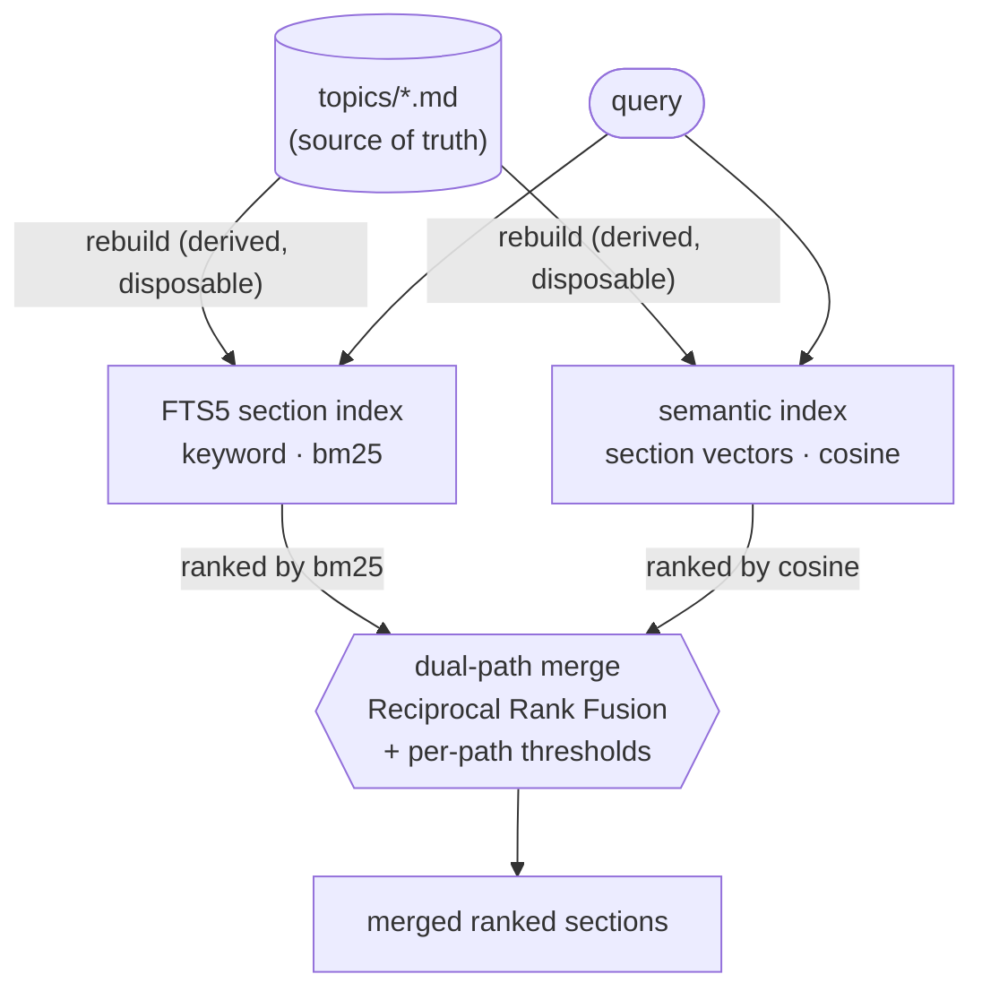
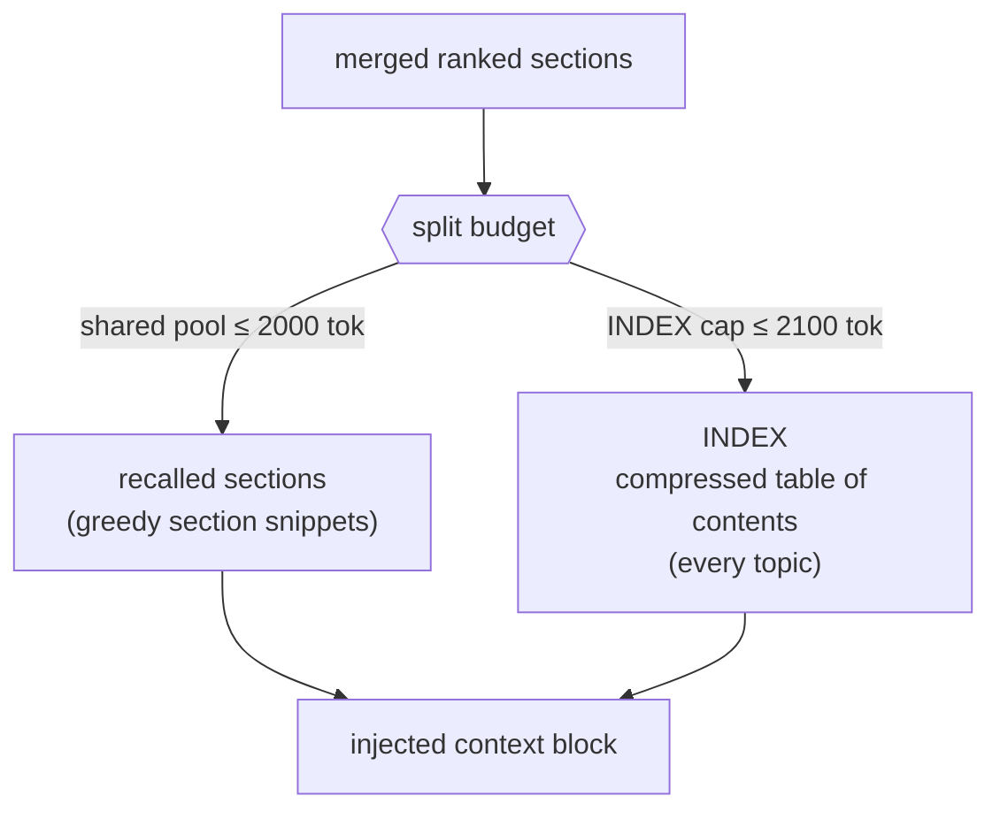

# Architecture — evidence-grounded-memory

**Status:** Active
**Scope:** memory retrieval + provenance/evidence layer

## Purpose

The long-form design narrative behind the reference implementation: the problem framing, the eight
design decisions, and the boundary between what this repo publishes and what it deliberately withholds.
The [repo README](../README.md) is the compressed read; this is the depth.

---

## The problem

"Agent memory" is usually shorthand for a vector database: embed every chunk, retrieve top-k by cosine
similarity, paste into the prompt. That framing answers one narrow question — *which text is semantically
nearest the query* — and treats memory as a lookup. Memory is a stack of layers, and a vector-DB framing
collapses all but one — quietly assuming away the problems that make persistent memory hard at production
scale. Four of them:

### 1. What *is* the memory? (substrate)

A vector index is opaque, lossy, and unauditable — you can't read it, diff it, or hand a topic to a human
and say "this is what the agent knows about you." This system treats durable, human-readable **markdown
topic files** (`topics/*.md`, H2-sectioned) as the *source of truth*, and every index — keyword and
semantic — as a **derived, disposable view** rebuilt from that text. Semantic search is a retrieval
path, **not** the memory system. This file-first stance is the foundation the other three problems are
solved on top of.

### 2. One retrieval path is never enough (plural retrieval)

Pure semantic search misses exact-match technical terms (a permit code, a person's name); pure keyword
search misses conceptual proximity. You need both running in parallel with a merge layer that reconciles
them — and it must inject only the relevant *section* of a topic, inside a fixed token budget that no
single topic is allowed to monopolize.

### 3. Not all facts deserve equal trust (provenance)

A claim from a statute, from a forum post, from the user directly, and from the model's own inference
cannot be weighted the same. Memory needs provenance — every fact carries where it came from — and an
authority model that governs how conflicts resolve and when output is flagged for verification.

### 4. Authority is temporal, not fixed at write time (temporal authority)

Vector search can surface an old fact, but it has no way to represent that the fact's standing has
changed. Facts arrive at different times from sources of different strength, and their standing
*changes as evidence accumulates*. A fact can enter the store as a
low-tier user statement or AI inference, then be **promoted** when a higher-authority document later
corroborates it — or **superseded** when an authoritative source contradicts it. Memory is therefore a
*living evidentiary record*: provisional on entry, continuously re-graded, and held coherent over time by
a scheduled consolidation pass that dedups, reconciles, and re-tiers. Without that, the corpus drifts
into contradiction and stale confidence.

These four problems map directly onto decisions #1–#7 below. An eighth decision — **source-document
recall** — extends the same file-first thesis to a second substrate (held documents), and is covered in §8.

---

## The architecture

**File-first.** Human-readable markdown topic files are the source of truth; the keyword (FTS5) and
semantic (vector) indexes are derived views rebuilt from that text.

**Dual-path recall.** Both indexes run in parallel and a merge layer reconciles their results.

**Split-budget passive injection.** The relevant *sections* are assembled into the prompt before each
call, within a fixed, partitioned token budget.

**Interwoven provenance layer.** Every fact is tagged with its source and authority tier.

**Scheduled consolidation.** Because authority is temporal, a scheduled pass re-grades the corpus over
time — promoting corroborated facts, marking superseded ones, deduplicating, and keeping tiers honest.

**Source-document recall.** Held documents are a second substrate alongside topic memory: a passive
per-agent inventory plus a derived content index make a document's text discoverable and recallable, so the
repository can surface its own primary sources.

> **Lineage.** The file-first, inject-the-markdown-into-the-prompt foundation is well-trodden. Vercel's
> *AGENTS.md outperforms skills in our agent evals* (Jude Gao, Jan 2026) found passive context scored
> **100%** where leaving the agent to *decide* to retrieve scored **53%** — *"there's no moment where the
> agent must decide 'should I look this up?' The information is already present."*
> ([source](https://vercel.com/blog/agents-md-outperforms-skills-in-our-agent-evals)) Open-source
> assistants like [OpenClaw](https://github.com/openclaw/openclaw) run on the same injected-markdown
> pattern (`AGENTS.md`, `SOUL.md`). This repo takes that foundation as given; its contribution is the
> layers built on top — authority-tiered provenance (#3/#4) and temporal re-grading (#5). The "no decision
> point" principle is exactly what #8 applies to source documents: discovery as a structural invariant.

---

## Key design decisions

### 1. Dual-path recall (keyword + semantic, merged)

FTS5 keyword index and semantic vector search run in parallel, then a merge/ranking layer combines them.
Pure semantic search misses exact-match technical terms; pure keyword search misses conceptual proximity.
The merge — not either path alone — is the point.

Hybrid keyword+semantic retrieval is, by now, a well-established pattern — *not* a novel contribution, and
not presented as one. It's documented here because the system rests on it and because the *integration*
choices are what matter: running it at **section** granularity, over a **file-first / derived-disposable**
source of truth, with per-path admission thresholds, feeding the **split budget** (#2). The pattern is
table stakes; the way it's wired into an evidentiary memory is the point.

The reference merge is **Reciprocal Rank Fusion** — it combines the two *rankings*, not raw scores, so no
cross-path score calibration is needed. Production uses tuned score-fusion weights; those are the withheld
calibration. (Diagram: [diagrams/dual-path-recall.md](diagrams/dual-path-recall.md).)

### 2. Split-budget context injection

A fixed injection budget split between a shared pool (~2K tokens) and a separate INDEX cap (~2.1K).
Prevents any single topic from crowding out cross-domain context. A deliberate architectural constraint,
not a default.

Because the shared pool and the INDEX have *independent* caps, a single large or highly-relevant topic
can fill the pool without starving the cross-domain map. (Diagram:
[diagrams/budget-split.md](diagrams/budget-split.md).)

> *Production note:* the production system also injects CORE profile, tasks, session summaries, and a
> temporal summary. The reference version simplifies to the shared-pool / INDEX split to keep the story
> clean. The illustrative token allocations here are re-derivable defaults, not tuned production values.

### 3. Authority-tiered provenance (the evidence layer)

A 7-tier / 14-category source vocabulary. Every memory bullet carries an inline tag (`[doc:e037·A]`,
`[user]`, `[ai]`). The tier governs how conflicting facts are weighted and whether output is flagged for
verification. This is **interwoven with the memory system, not a separate module** — which is why
`evidence/` and `memory/` live in one repo.

### 4. Sources registry

A canonical registry of all ingested documents (`sources.jsonl`). Inline provenance tags in memory
bullets resolve back to this registry for full metadata (label, category, tier, recency, scope-fit).

### 5. Temporal authority — promotion & supersession

**The part conventional vector-memory designs usually do not model.** Authority is not stamped once at
write time; a fact's standing evolves as evidence
accumulates. The system makes that evolution *first-class and auditable* rather than destructive:

- **Provisional on entry.** A fact written from a user statement (`[user]`, Tier F) or model inference
  (`[ai]`, Tier G) enters at low authority — it is recorded, not trusted.
- **Promotion via corroboration.** When a higher-authority source later confirms the same claim, the
  bullet gains an inline `(confirmed by <ref>)` annotation — its effective trust rises without rewriting
  history.
- **Supersession, recorded bidirectionally.** When an authoritative source contradicts an existing
  bullet, the system writes a *paired* annotation: the new bullet gets `(supersedes …)` and the old
  bullet gets `(superseded YYYY-MM-DD by <ref>)`. The original is never deleted — the audit trail of
  *what the agent believed and why it changed* is preserved.
- **Two trigger points, same record.** Re-grading happens **synchronously** (in-conversation: when a
  higher-tier source enters the chat, the agent reconciles it against injected memory and updates in the
  same turn — firing on the evidence, informing the user rather than asking) **and asynchronously** (the
  scheduled consolidator backstops runtime omissions and pre-feature corrections).

(Diagram: [diagrams/tier-flow.md](diagrams/tier-flow.md).)

Stated plainly: *memory is an evidentiary record with a changelog, not a key-value store.* Trust is
a function of corroboration over time, and the system encodes that as durable, human-readable annotations
rather than silent overwrites. Decisions #3 (tiers) and #4 (sources) supply the vocabulary; this decision
is what makes them *dynamic*. Decision #6 is one of its two execution paths.

### 6. Scheduled consolidation

A scheduled agent pass that merges, deduplicates, and re-tiers memory topics — keeping the knowledge base
coherent over time without manual curation. It is the *asynchronous* execution path for the temporal
re-grading in #5 (catching corroboration/supersession the runtime missed) plus the mechanism that
prevents corpus drift. Non-destructive, idempotent, budget-aware.

> *Reference scope:* the runnable consolidator here is deliberately slim — bullet dedup + re-tier via the
> sources registry. Task archival, profile dedup, and topic-reorg overflow handling exist in production
> and are described-only.

### 7. Section-level indexing

Topics are H2-sectioned markdown; the FTS5 index operates at the *section* level, not the document level.
This enables budget-aware injection of just the relevant section rather than a whole topic — the
mechanism that makes decision #2 possible.

### 8. Source-document recall

Held documents (uploaded files) are a second knowledge substrate alongside topic memory: where topics hold
*distilled* knowledge, documents hold *primary-source* knowledge. Two ideas make them usable — and they are
what this decision is about, **not** the retrieval technology, which is the same standard FTS5 as #1:

- **Passive discovery as a structural invariant.** A per-agent inventory of held documents is surfaced in
  context every turn, so the agent is *told what sources it has* rather than having to remember to search.
  The production failure this fixes was filename-only matching — a document whose answer lived in its body
  went unfound because its *name* didn't contain the query terms.
- **Documents as a first-class substrate.** A derived FTS5 index over `filename + gist + body` makes a
  document's content addressable, and its `[doc:<ref>·<tier>]` citation (#4) resolves to recallable text,
  not just a registry label. The index is per-agent, derived, and disposable — exactly like the topic index.

The demo shows **discovery feeding re-grading**: a content query surfaces the contractor quote a filename
search misses, and that same document then drives the supersession in #5 (remove the discovery step and the
re-grading has no source to cite). The runnable demo is single-tenant; **per-agent isolation** — one index
per agent, so a document never surfaces for an agent that doesn't own it — is a production property
described here but not exercised by the demo (it's an assertion about deployment, not an algorithm).

> *Reference scope:* the index and inventory run in the neutral domain. Document text is committed directly
> (in production it comes from OCR); the gist is authored (in production a utility model generates it,
> mirroring `ai_summary`); and the `possibly related` overlap threshold, budget figures, and ranking
> weights are withheld calibration.

---

## Publication boundary

This repo distinguishes **sanitization** (mechanically scrubbing client/infra/tenancy specifics) from the
**publication boundary** (a strategic call about how much *design depth* to publish per decision).

**Governing principle:** *publish the what and why; withhold the calibration.* The architecture and its
rationale are the asset and cost little to share. The **tuning** — vocabularies calibrated over real
engagements, production prompts, thresholds, ranking weights, and eval results — is what stays in-house.
A reference implementation should *demonstrate* each decision, not ship the production-tuned artifact.

**Standing rules:**

- **No production prompts.** Extraction, consolidation, and reconciliation system prompts are withheld;
  reference modules use minimal illustrative prompts.
- **No eval results or tuning data.** No benchmark numbers, thresholds chosen from real data, or ranking
  weights presented as production values (illustrative defaults are fine, labeled as such).
- **The repo is a hook, not a spec.** When in doubt, publish the principle and a clean demo; keep the
  deeper detail out of the repo.

| # | Decision | Publish (the asset) | Withhold (kept in-house) | Sensitivity |
|---|---|---|---|---|
| 1 | Dual-path recall | The merge concept + a working keyword/semantic merge in the neutral domain | Production ranking weights / score-fusion tuned on real data | Low |
| 2 | Split-budget injection | The split principle + partition rationale; illustrative token allocations | — (defaults are re-derivable) | Low |
| 3 | Authority-tiered provenance | Tag format, the 7-tier skeleton, the *concept* of MECE categories | The tuned 14-category cue table (domain-calibrated recognition cues) — generic version only | **High** |
| 4 | Sources registry | Schema shape + tag→source resolution flow | Production enrichment heuristics (independence/recency/scope-fit scoring) | Med |
| 5 | Temporal re-grading | The concept, annotation format, the two-trigger design | Production reconciliation prompts + promotion/supersession heuristics + thresholds | **High** |
| 6 | Scheduled consolidation | The slim dedup + re-tier loop; non-destructive / idempotent / budget-aware principles | Production merge prompts + LLM-judgment heuristics; the full sub-task set | Med |
| 7 | Section-level indexing | Fully — standard technique, no calibration to protect | — | Low |
| 8 | Source-document recall | Passive inventory + derived content-index mechanism; discovery-as-invariant + the document substrate | Budget figures, the `possibly related` overlap threshold, ranking weights; per-agent isolation is described-only | Low |

The two **High** rows (#3 cue table, #5 mechanism) are where "are we publishing too much?" actually
bites. The handling: publish the principle and shape in full; withhold the calibrated cue table and the
production prompts/thresholds. Publishing #5 is treated as deliberate,
irreversible prior art — not a default.
