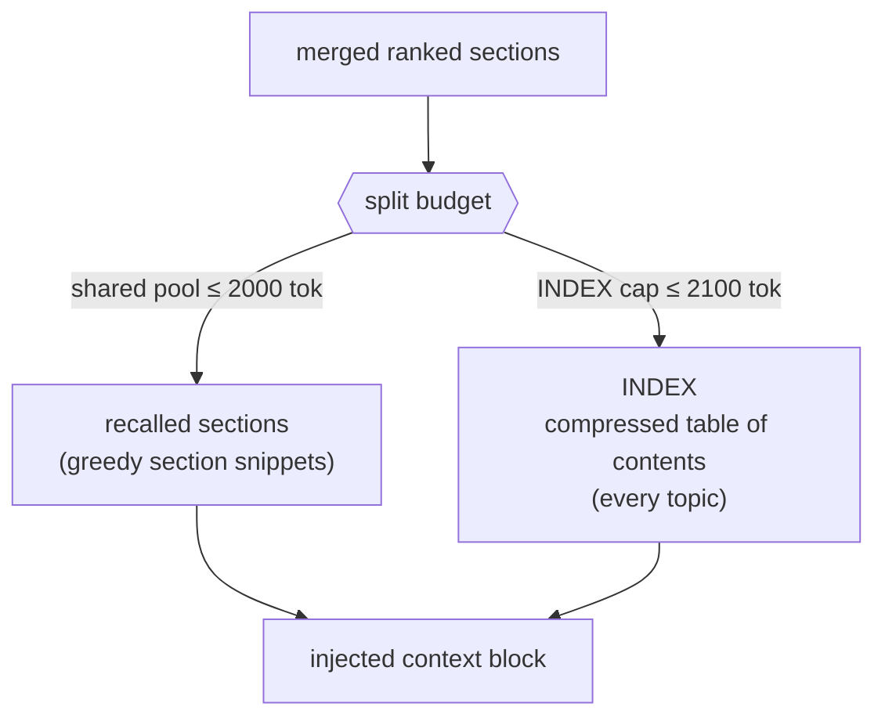

# Split-budget injection (decision #2)

The merged sections are packed into a **fixed, partitioned** token budget. The partition is the point: a
shared pool holds the top section snippets, and a *separate* INDEX cap holds a compressed table of
contents naming every topic. Because the two have independent caps, a single large or highly-relevant
topic can fill the shared pool **without** starving the cross-domain map — the INDEX still tells the model
what else memory knows about. The token allocations are illustrative, re-derivable defaults.

Section-level granularity (decision #7) is what makes this meaningful: the packer admits *sections*, not
whole topics, so the budget buys relevant context instead of one topic's bulk.

Implementation: [`memory/injector.py`](../../memory/injector.py) (`MemoryBudget`, `inject`).
