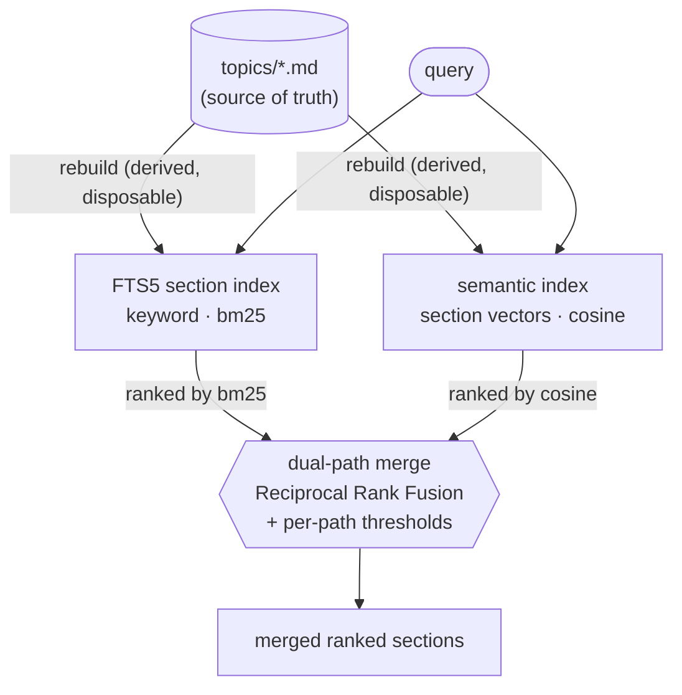

# Dual-path recall (decision #1)

The markdown topic files are the source of truth; the keyword (FTS5) and semantic (vector) indexes are
**derived and disposable**, rebuilt from that text. A query runs *both* paths in parallel, and a merge
layer reconciles their two rankings. Neither path alone is sufficient — exact technical terms come from
the keyword path, conceptual proximity from the semantic path — so the **merge** is the point.

The merge is **Reciprocal Rank Fusion**: it combines the two *rankings* rather than raw scores, so no
cross-path score calibration is needed. (Production uses tuned score-fusion weights; those weights are the
withheld calibration — RRF is the clean, re-derivable default published here.)

Implementation: [`memory/store.py`](../../memory/store.py) (keyword path),
[`memory/semantic_index.py`](../../memory/semantic_index.py) (semantic path),
[`memory/injector.py`](../../memory/injector.py) (`merge_dual_path`).
