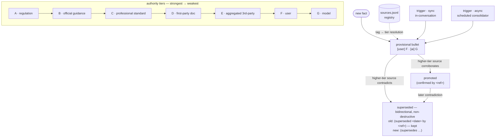

# Authority tiers & temporal re-grading (decisions #3–#5)

Every fact carries an authority tier (A strongest … G weakest). A fact written from a user statement
(`[user]`, F) or a model inference (`[ai]`, G) enters **provisional** — recorded, not yet trusted. Its
standing then evolves as evidence accumulates: it is **promoted** when a higher-authority source
corroborates it, or **superseded** when one contradicts it. Supersession is recorded *bidirectionally and
non-destructively* — the original bullet is annotated, never deleted, preserving the audit trail of what
the agent believed and why it changed. Inline tags resolve to full source metadata through the
`sources.jsonl` registry, and re-grading fires from **two triggers**: synchronously in-conversation and
asynchronously via the scheduled consolidator.

Implementation: [`evidence/tiers.py`](../../evidence/tiers.py),
[`evidence/sources.py`](../../evidence/sources.py),
[`memory/store.py`](../../memory/store.py) (`confirm_bullet` / `supersede_bullet`),
[`memory/consolidator.py`](../../memory/consolidator.py).
